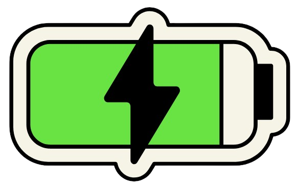

# <p align="center">GridSync App</p>

<p align="center"></p>
<p align="center">This is the repository for the GridSync application that simulates real V2G user contracts.</p>

### Prerequisites

- **Node.js** and **Yarn** must be installed on your machine. You can verify if you have these by running the following commands

```bash
node -v
yarn -v
nvm -v  # For Windows, use 'nvm version'
```

### Steps

1. First, start by cloning this repository to your local machine

```bash
git clone https://github.com/grid-stream-org/frontend.git
```

2. Navigate into the project directory

```bash
cd frontend
```

3. Install and use the version of node specified in the `.nvmrc` file by running the following commands

```bash
nvm install
nvm use
```

Note:
You may have to specify the actual version you wish to user here, as some operating systems don't pick upon the contents of the `.nvmrc` file. Try `nvm install <version> && nvm use <version>`

4. Install the necessary dependencies

```bash
yarn install
```

5. At this point, you can run the client

```bash
yarn run dev
```

Client application should be running at `http://localhost:5173`
